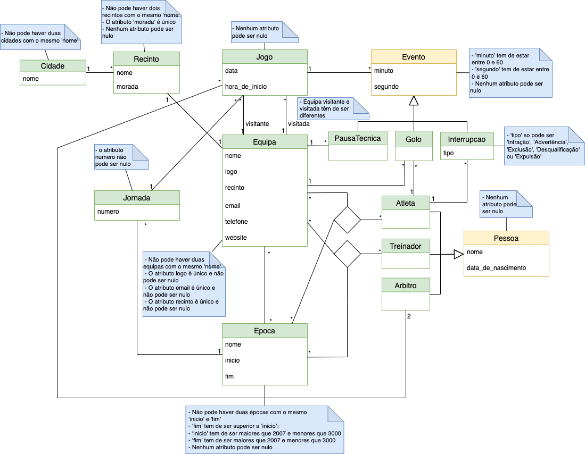

# A **Database** for the Portuguese male **Handball Championship**

>**Project**
> 
>Course Unit: [Bases de Dados](https://sigarra.up.pt/feup/pt/ucurr_geral.ficha_uc_view?pv_ocorrencia_id=501674 "Databases"), 2nd year 
> 
>Course: **Informatics and Computer Engineering** 
> 
> Faculty: **FEUP** (Faculty of Engineering of the University of Porto)
> 
> Report: [Relatório.pdf](./Relatório.pdf)
> 
> Evaluation: **19**/20

## Project Goals

The purpose of this project is to explore some concepts of **relational databases** and **SQL**. The project was divided in 2 parts:

1. **Design** the database schema, using the **UML** (Unified Modeling Language) and the **ER** (Entity-Relationship) models.
2. **Implementation** of the database, using the **SQL** language.

Performance was not a goal of this project, so the database was not optimized.
The database was implemented in **SQLite3** and tested in [Beekeper Studio](https://github.com/beekeeper-studio/beekeeper-studio).

## Database UML Scheme

 

In order to implement some of the restrictions presented in the UML model, some **SQL triggers** were created. The triggers are presented in the [triggers](./triggers) folder.

There are also some **queries** at [queries](./queries).

## Populating the database

The database was populated with real data from the oficial handball league website. 
To do this, we created a  **scraper** in python. If you are curious about it, check [scraper](./scraper) folder.
